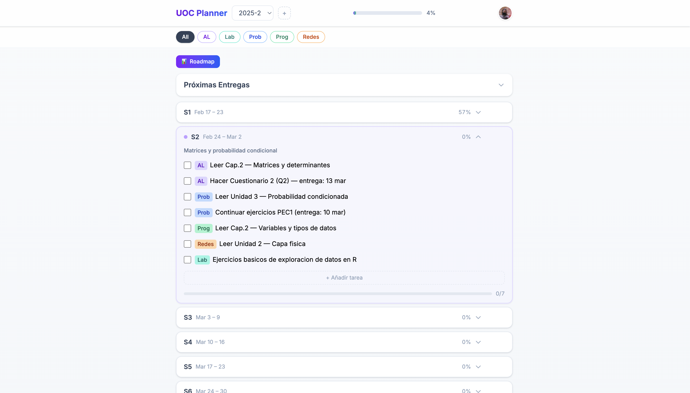
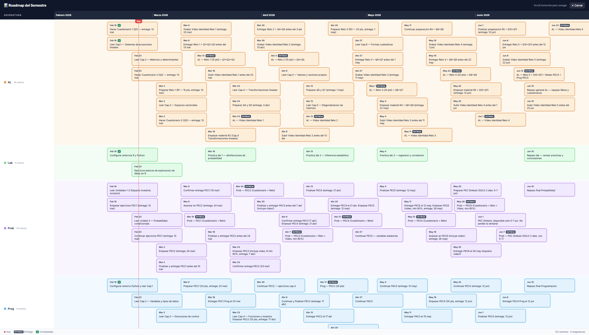

# 📚 UOC Planner

A weekly planner for [UOC](https://www.uoc.edu) (Universitat Oberta de Catalunya) students. Visualize your courses, deadlines, and weekly tasks in a modern interface with a full semester roadmap.

Developed by Edgar [@edbrsk](https://github.com/edbrsk/)





## ✨ Features

- 📅 **Weekly planning** — Tasks organized by week and course
- 📊 **Visual roadmap** — Swimlane timeline of all semester deliverables
- 🔥 **Real-time sync** — Firebase-backed, works across devices
- 💾 **Offline mode** — Works without an account using browser localStorage
- 🔒 **Self-hosted data** — Each user connects their own Firebase project
- ⚡ **Upcoming deadline highlights** — Deliverables due within 15 days are flagged
- ⬆️ **JSON import** — Paste LLM-generated planning data directly into the app
- ⬇️ **JSON export** — Export your modified data to share or back up
- 📲 **Installable PWA** — Add to home screen on iOS and Android for a native app experience
- 🖨️ **Print-ready** — Optimized layout for printing
- 📱 **Responsive** — Works on desktop and mobile

---

## 📲 Install as App

UOC Planner is a Progressive Web App (PWA) — you can install it on your phone for a native app look and feel, no app store needed.

### iOS (Safari)
1. Open the app in **Safari**
2. Tap the **Share** button (⬆️)
3. Select **"Add to Home Screen"**
4. Tap **"Add"**

### Android (Chrome)
1. Open the app in **Chrome**
2. Tap the **three-dot menu** (⋮)
3. Select **"Add to Home Screen"** or **"Install App"**
4. Tap **"Install"**

The app will appear on your home screen with its own icon and launch in full-screen mode, just like a native app.

---

## 🎮 Quick Demo (no setup required)

Want to try the app without any configuration?

1. Open the app and click **💾 Usar sin cuenta (offline)**
2. Click your profile avatar (top-right) → **⬆️ Importar JSON**
3. Copy the contents of [`demo/uoc_planner_2025-2.json`](demo/uoc_planner_2025-2.json) and paste it
4. Click **Validar JSON** → **Importar semestre**
5. Explore the full app with 18 weeks, 5 courses, and 30+ deadlines!

---

## 🚀 Setup

### Option 1: Offline mode (no account)

Just click **💾 Usar sin cuenta (offline)** on the login screen. Your data is stored in the browser's localStorage — no Firebase, no Google account needed.

### Option 2: Firebase (cloud sync)

1. Go to [console.firebase.google.com](https://console.firebase.google.com)
2. Create a new project (free **Spark** plan)
3. Add a **Web app** and copy the `firebaseConfig` object
4. Enable **Authentication → Google** as a sign-in provider
5. Create a **Firestore Database** in test mode
6. On the setup screen, paste your `firebaseConfig` JSON

### Running locally

```bash
git clone https://github.com/edbrsk/uoc-planner.git
cd uoc-planner
npm install
npm run dev
```

---

## 📊 Generating Your Data with AI

The power of UOC Planner is that an LLM (Claude, ChatGPT, etc.) can automatically generate your entire weekly plan by analyzing your virtual campus.

### Recommended: Claude + Canvas LMS MCP

1. **Install the Canvas MCP server** — [mcp-canvas-lms](https://github.com/DMontgomery40/mcp-canvas-lms)
2. **Generate an access token** from your campus:
   - Navigate to [aula.uoc.edu/profile/settings](https://aula.uoc.edu/profile/settings)
   - Find the **"Approved Integrations"** section
   - Generate a new access token
3. **Configure the MCP** in Claude Desktop with your token and Canvas base URL
4. **Use the prompt below** to generate your planning data

### Alternative: without the MCP

If you don't have the Canvas MCP, you can manually copy the syllabus, calendar, and deliverable schedule from each course in your virtual campus, then paste it into a chat with your preferred LLM alongside the prompt and JSON schema below.

### Prompt

>You have access to my Canvas LMS courses for the current semester. I need you to build a comprehensive weekly study plan.
>
>Instructions:
>
>1. List all active courses and retrieve their assignment schedules and important dates.
>2. For each course, identify every deliverable (PECs, PACs, exams, quizzes, videos, projects) with its exact due date AND its unlock_at date from Canvas.
>3. Note that some courses describe tasks as "to be done during week X" rather than giving a hard deadline — treat the end of that week as the effective deadline.
>4. Cross-reference all courses to detect weeks with multiple overlapping deadlines.
>5. Unlock-date rule: Never schedule a task to start or work on an assignment in a week before its Canvas unlock_at date. If an assignment unlocks mid-week, it may appear that >week but
>the task text must include (abre DD mmm) with the actual unlock date. For weeks before the unlock, replace "start/do assignment" tasks with study/reading tasks that prepare >for it
>(e.g., "Estudiar material modulos X-Y (preparacion PEC1, abre 4 mar)").
>6. Video submissions: These typically have very short unlock windows (3–5 days). Only place video tasks in the week they actually unlock — never earlier. Include both the >unlock and due
>dates in the task text.
>7. Combined tasks: When a delivery deadline and the next assignment's start fall in the same week but the new assignment isn't unlocked yet, use separate task entries — one >for the
>delivery, one for study/preparation. Never combine "Entregar X. Empezar Y" if Y isn't unlocked yet.
>8. Produce a week-by-week study plan across all courses simultaneously, in a "what should I be working on this week" style — not isolated per course, but interleaved based on >urgency
>and workload.
>9. Output the result as a single JSON object using the exact schema below, ready for import into my planner app.
>
>JSON Schema:
>
>{
>"semester": {
>    "name": "2025-2",
>    "label": "Semester 2025-2",
>    "startDate": "2026-02-17",
>    "endDate": "2026-06-22"
>},
>"weeks": {
>    "1": { "dates": "Feb 17 – 23", "title": "Semester kickoff" },
>    "2": { "dates": "Feb 24 – Mar 2", "title": "..." }
>},
>"tasks": [
>    { "weekNum": 1, "course": "CourseAbbr", "text": "Task description", "order": 0, "done": false }
>],
>"deadlines": [
>    { "date": "2026-03-10", "label": "CourseAbbr — Deliverable name", "course": "CourseAbbr", "urgent": false, "order": 0 }
>]
>}
>
>Rules:
>
>- Use short, consistent abbreviations for course names (e.g., "AL", "Prob", "Prog").
>- Dates must be in YYYY-MM-DD format.
>- Each week should have 3–8 tasks covering multiple courses.
>- Set "urgent": true only for deliverables with unusually short windows (≤ 3 days).
>- Order tasks within each week by priority.
>- The "dates" field should be a human-readable range (e.g., "Mar 3 – 9").
>- Every task that references an assignment must respect its unlock_at — if locked, the task should be study/preparation only, with the unlock date noted in parentheses.

---

## ⬆️ Import & ⬇️ Export

Both features are accessible from the **profile menu** (click your avatar in the top-right corner).

### Importing JSON

1. Click your profile avatar → **⬆️ Importar JSON**
2. Paste the complete JSON (from an LLM, an export, or the demo file)
3. Click **Validar JSON** — a preview shows courses, task count, and deadline count
4. Click **Importar semestre**

### Exporting JSON

1. Click your profile avatar → **⬇️ Exportar JSON**
2. A `.json` file downloads with the exact same schema used for import
3. Share it, back it up, or re-import it later

This means you can: generate data with AI → import → modify in the app → export → share with classmates.

---

## 📋 JSON Schema Reference

| Field | Type | Description |
|-------|------|-------------|
| `semester.name` | `string` | Unique identifier (e.g., `"2025-2"`) |
| `semester.label` | `string` | Display name (e.g., `"Semester 2025-2"`) |
| `semester.startDate` | `string` | Start date in `YYYY-MM-DD` format |
| `semester.endDate` | `string` | End date in `YYYY-MM-DD` format |
| `weeks.N.dates` | `string` | Human-readable date range (e.g., `"Feb 17 – 23"`) |
| `weeks.N.title` | `string` | Week summary / theme |
| `tasks[].weekNum` | `number` | Week number (1, 2, 3...) |
| `tasks[].course` | `string` | Course abbreviation (e.g., `"AL"`) |
| `tasks[].text` | `string` | Task description |
| `tasks[].order` | `number` | Sort order within the week (0, 1, 2...) |
| `tasks[].done` | `boolean` | Completion status — default `false` |
| `deadlines[].date` | `string` | Due date in `YYYY-MM-DD` format |
| `deadlines[].label` | `string` | Deliverable description |
| `deadlines[].course` | `string` | Course abbreviation |
| `deadlines[].urgent` | `boolean` | `true` for extremely short submission windows |
| `deadlines[].order` | `number` | Display order |

---

## 🏗️ Tech Stack

| Technology | Purpose |
|------------|---------|
| React 19 | UI components |
| Vite 6 | Build tool + dev server |
| TailwindCSS v4 | Styling |
| Firebase Firestore | Real-time database (optional) |
| Firebase Auth | Google sign-in (optional) |
| localStorage | Offline data storage |
| GitHub Pages | Deployment |

## 📦 Deployment

The app deploys automatically to GitHub Pages via GitHub Actions on every push to `main`. See [`.github/workflows/deploy.yml`](.github/workflows/deploy.yml).

## 🛠️ Development

```bash
npm run dev      # Dev server (http://localhost:5173)
npm run build    # Production build
npm run preview  # Preview production build
```

## 📁 Project Structure

```
├── demo/
│   └── uoc_planner_2025-2.json   # Demo data for quick testing
src/
├── App.jsx                        # Main application component
├── main.jsx                       # Entry point
├── index.css                      # Global styles + Tailwind
├── lib/
│   ├── firebase.js                # Dynamic Firebase initialization
│   ├── constants.js               # Colors, date helpers
│   └── store.js                   # Offline localStorage data layer
├── hooks/
│   ├── useAuth.js                 # Authentication (Firebase + offline)
│   ├── useSemesters.js            # Semester CRUD (Firebase + offline)
│   ├── useTasks.js                # Task CRUD (Firebase + offline)
│   └── useDeadlines.js            # Deadline CRUD (Firebase + offline)
└── components/
    ├── AuthScreen.jsx             # Login screen (Google + offline)
    ├── SetupScreen.jsx            # Firebase / offline mode selection
    ├── Header.jsx                 # Header + profile dropdown
    ├── CoursePills.jsx            # Course filter pills
    ├── WeekCard.jsx               # Collapsible week card
    ├── TaskItem.jsx               # Individual task item
    ├── DeadlinesSection.jsx       # Deadline table
    ├── RoadmapView.jsx            # Swimlane roadmap
    ├── ImportModal.jsx            # JSON import modal
    ├── Modal.jsx                  # Reusable modal shell
    ├── TaskModal.jsx              # Task form
    ├── DeadlineModal.jsx          # Deadline form
    ├── SemesterModal.jsx          # Semester + week forms
    └── Toast.jsx                  # Toast notifications
```

## 📄 License

MIT
